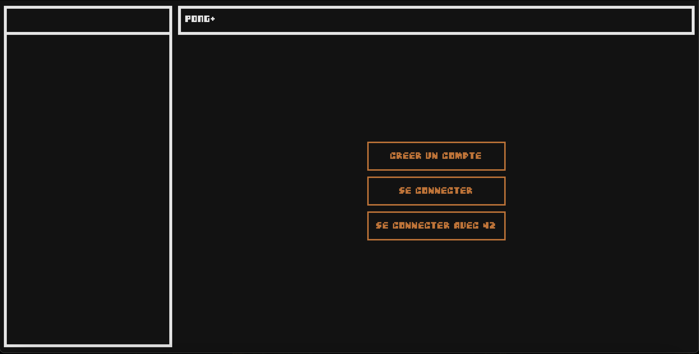
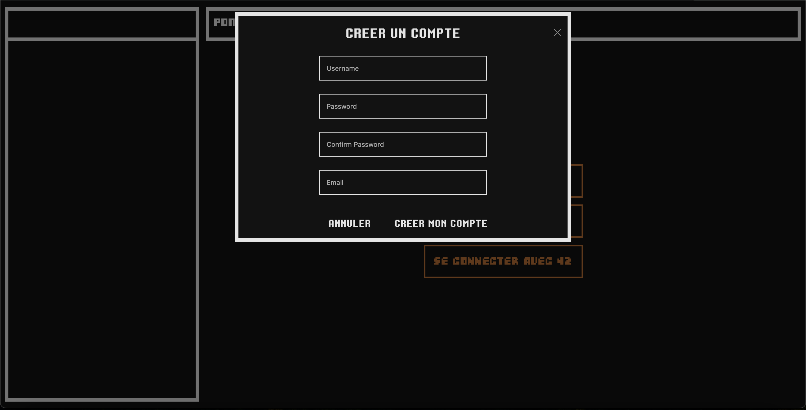
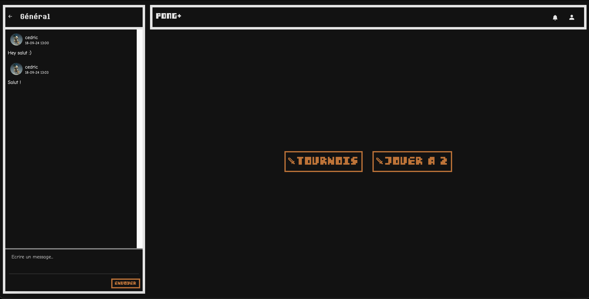
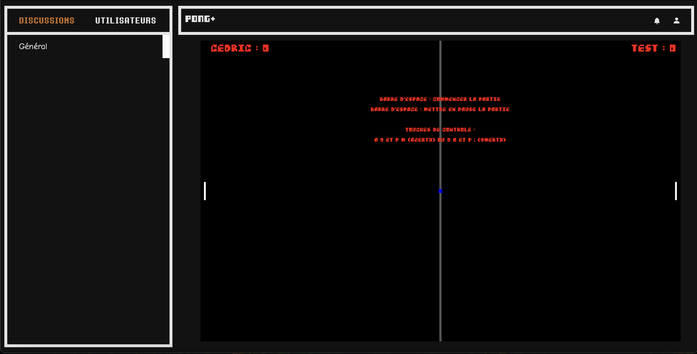

# Transcendance

Projet de fin de tronc commun 42 Paris

## Table des matières

- [Description du projet](#description-du-projet)
- [Fonctionnalités](#fonctionnalités)
- [Installation](#installation)
- [Technologies](#technologies)
- [Aperçu](#aperçu)
- [Contributeurs](#contributeurs)

---

## Description du projet

Transcendance est un projet web développé dans le cadre de l'école 42. Il s'agit d'une plateforme interactive proposant deux jeux: un en ligne, l'autre en local; un système de chat en groupe et une gestion complète des utilisateurs. Ce projet met en œuvre un front-end moderne, un back-end performant et une base de données robuste.

L'objectif de ce projet était de fournir une expérience utilisateur fluide et agréable tout en respectant les bonnes pratiques de développement.

---

## Fonctionnalités

- 🎮 Deux jeux intégrés dont un en ligne et un autre avec un systeme de tournois
- 💬 Chat en temps réel
- 🔒 Système d'authentification sécurisé
- 🗄️ Gestion de la base de données utilisateurs
- 🎨 Interface utilisateur moderne et réactive

---

## Installation

### Prérequis

Si sur mac, installer au préalable la version docker Desktop

### Étapes d'installation

1. Clonez ce dépôt :
    ```bash
    git clone https://github.com/Hooks42/Transcendance.git
    ```

2. Créez un fichier `.env` à la racine du projet et configurez les variables d'environnement nécessaires

4. Lancez le projet :
    ```bash
    make
    ```

---

## Technologies

- **Front-end :** Bootstrap, javascript (Vanilla), HTML, CSS
- **Back-end :** Daphne, Django, Python
- **Base de données :** PostgreSQL
- **Authentification :** OAuth 2.0
- **WebSocket :** pour le chat en temps réel

---

## Aperçu

### Interface Home


### Interface de connexion


### Interface de chat


### Jeu en ligne


---

## Contributeurs

- **Isabelle Ren** - Développeur Front-End
- **Cédric Atgié** - Développeur Back-End
- **Romain Rovillar** - Développeur Back-End
- **Adrien Maupied** - Intégration et tests
